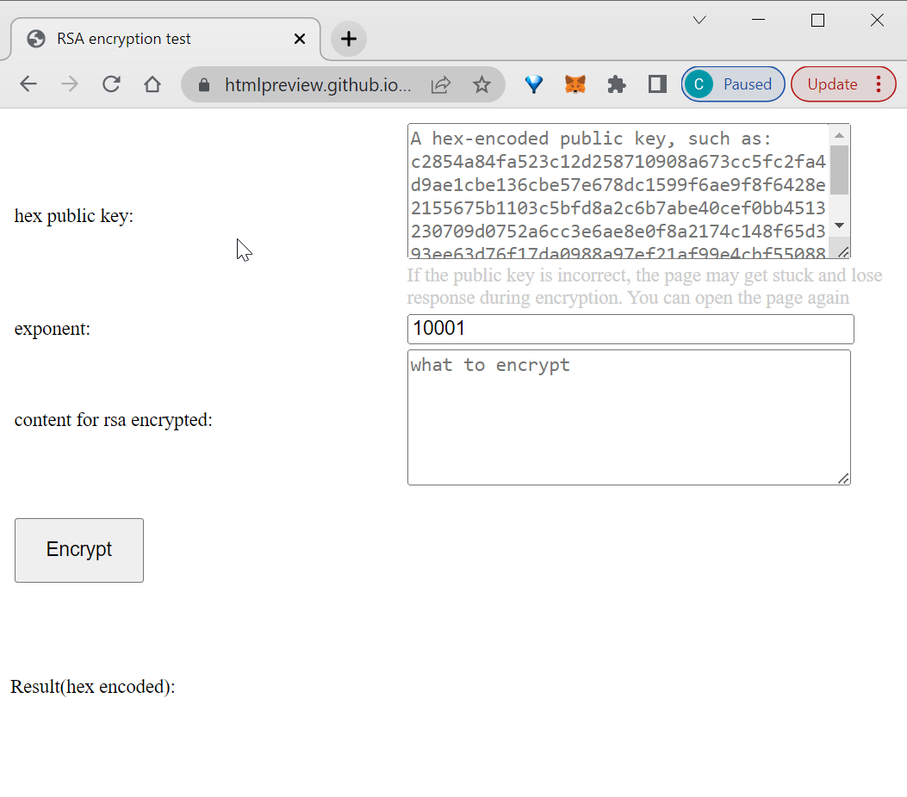
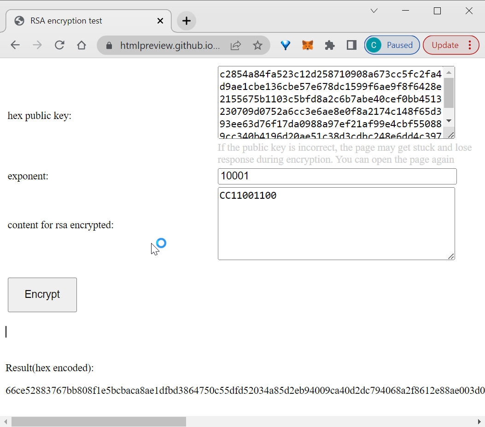

# RSA libs

# 一、这是什么

RSA加密需要依赖的一些文件，在进行JavaScript逆向的时候经常会遇到一些RSA类型的加密，如果我们有一个RSA加密库就不必辛苦从目标网站的页面中扣那么多代码了，只需要扣出来加密需要的参数然后引入这个库加密就可以了。

# 二、在线测试

访问下面的连接可以[在线测试](https://htmlpreview.github.io/?https://github.com/JSREI/rsa-libs/blob/main/examples/html/dev/index.html)：

```
https://htmlpreview.github.io/?https://github.com/JSREI/rsa-libs/blob/main/examples/html/dev/index.html
```

界面大概如下：



加密结果：



# 三、本地使用

`libs/dev`下的三个文件是未压缩的原始文件依赖，RSA加密需要依赖这三个文件，而`libs/dist/rsa.min.js`文件是把上面的三个文件打包压缩的单个文件，根据自己的需要拷贝到自己项目的依赖中，API的使用可以参考此文件：

```text
https://github.com/JSREI/rsa-libs/blob/main/examples/html/dev/index.html
```


